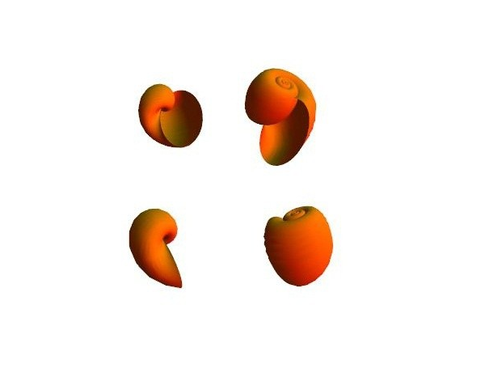

虚拟厨艺，就是使用电脑来作出食物的一种艺术。


所有的例子都在[我的下厨房](http://www.xiachufang.com/cook/10009708/)


## 清蒸苹果

[清蒸苹果](http://www.xiachufang.com/recipe/1079980/)


```
ParametricPlot3D[{(1 + Cos[v]) Cos[u] +
  0.085 Cos[5 u] + (0.994 v/\[Pi])^100, (1 + Cos[v]) Sin[u],
 6 Sin[v] + 2 Cos[v] -
  0.7 Log[1 - v/\[Pi]]}, {u, -\[Pi], \[Pi]}, {v, -\[Pi], \[Pi]},
Mesh -> False, BoxRatios -> 1, Boxed -> False, Axes -> None,
PlotStyle -> {Green, Specularity[Yellow, 10]}, ImageSize -> 500]
```

结果如下:


## 碧叶橄榄翡翠杯

完整过程在此：[碧叶橄榄翡翠杯](http://www.xiachufang.com/recipe/1049442/)

```
makeolive = Graphics3D[{ { FaceForm[Green, Orange],
Scale[Sphere[{0, 0, -1}], {1, 1, 1.5}, {10, 0, 0}]}, {Orange,
Cylinder[{ { 0, 0, -1}, {-10, -10, 1}}, 0.1]}}, Boxed -> False]
```

```
lotus = RevolutionPlot3D[1/10 Cos[t] - 10, {t, 0, 2.8 Pi},
 PlotStyle -> FaceForm[Green, LightGreen], Mesh -> None,
 Boxed -> False, Axes -> None, BoxRatios -> {10, 10, 0.2}]
```

```
Show[{RevolutionPlot3D[{1 t  Sin[t] + 7, 1.7  t Cos[t], -4 t}, {t, 0,
   5.7 }, PlotStyle -> {RGBColor[0, 1, 0, .5]}, Mesh -> None],
 makeolive, lotus}, ViewAngle -> Pi/40, ViewPoint -> {10, 10, 4},
ImageSize -> {360, 400}, Boxed -> False, Axes -> False,
SphericalRegion -> True]
```

结果如下:


## 田螺祭

[田螺祭](http://www.xiachufang.com/recipe/1049671/)


```
style = {Red, LightBlue, Gray, Purple, Yellow, Green, Cyan, Magenta,
  Brown, Orange, Pink};
```

```
viviparidae =
ParametricPlot3D[{1.16^v Cos[v] (1 + Cos[u]), -1.16^v Sin[
    v] (1 + Cos[u]), -2 1.16^v (1 + Sin[u])}, {u, 0, 2 Pi}, {v, -15,
  6}, Mesh -> False, PlotStyle -> Evaluate[RandomChoice[style]],
 PlotRange -> All, Boxed -> False, Axes -> None]
```

```
Grid[{ { vivshow, vivshow}, {vivshow, vivshow}}, ItemSize -> 10]
```

结果如下:


